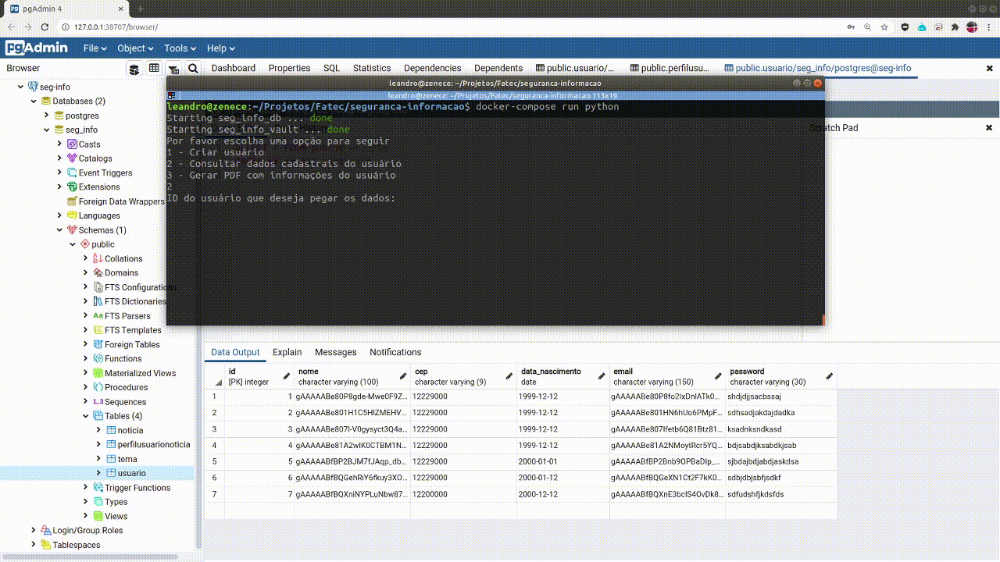
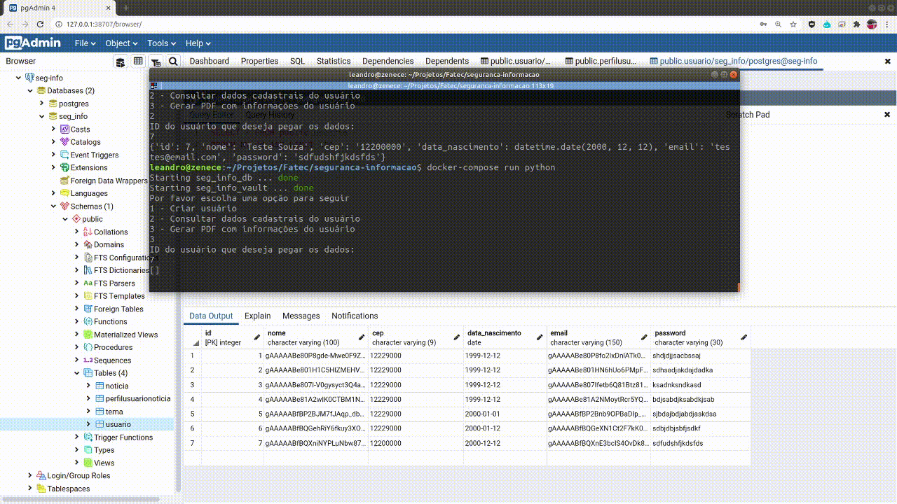
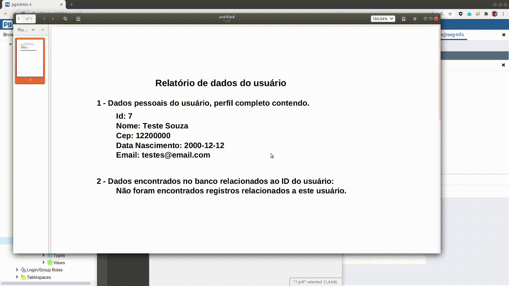

# Segurança da Informação

Esse projeto é resultado de um trabalho acadêmico na disciplina de Segurança da Informação da Faculdade de Tecnologia de São José dos Campos - Professor Jessen Vidal.

**Professor responsável:** Eduardo Sakaue

### Problema
**"Como garantir acesso aos dados criptogragados no Banco de Dados?"**

Com a nova LGPD, é possível que os dados sensíveis precisem ser criptografados no banco,
sendo assim é preciso uma rotina que automatize e torne viável essa pratica.

### Solução Proposta

Nossa solução é dividida em 3 grandes etapas:

1. Associar uma chave única na criptografia dos dados sensíveis de cada usuário;​

2. Armazenar essas chaves em algum lugar para futura consulta;

3. Quando preciso, nas Querys com dados criptografados, buscar a chave e descriptografar o que for necessário.

Para demonstrar o funcionamento, será gerado um relatório em PDF, com os dados criptografados de um usuário.

### Principais ferramentas utilizadas

* [Python 3.7](https://www.python.org/)
* [Vault](https://www.vaultproject.io/)
* [PostgreSQL](https://www.postgresql.org/)
* [Docker](https://www.docker.com/)
* [Docker Compose](https://docs.docker.com/compose/)

### Integrantes do Grupo

| Nome                               | Github                                | LinkedIn                                                    |
|------------------------------------|---------------------------------------|-------------------------------------------------------------|
| Leandro Lopes Bueno (Scrum Master) | [acessar](https://github.com/LLBueno) | [acessar](https://www.linkedin.com/in/leandro-lopes-bueno/) |
| Guilherme Rodrigo Cursino          | [acessar]()                           | [acessar]()                                                 |
| Murilo Leme                        | [acessar]()                           | [acessar]()                                                 |
| Mônica Torres                      | [acessar](https://https://github.com/Monica261)                           | [acessar](https://www.linkedin.com/in/mônica-torres-198875149)                                                 |
| Matheus Rothstein                  | [acessar]()                           | [acessar]()                                                 |

### Preview

**Acessando dados criptografados do banco**

**Gerando PDF com os dados descriptografados para o usuário**

**Visualizando resultado do PDF**

[Vídeo da aplicação](https://github.com/LLBueno/seguranca-informacao/blob/master/docs/SegInformacao.mp4)

### Executando o projeto

1. Todo o projeto está "dockerizado", logo só é necessário ter instalada
um versão recente do Docker e Docker Compose.

2. Realize um build para construir o ambiente e instalar as dependencias
   > $ docker-compose build

3. Crie um arquivo `.env` com base no arquivo `env-sample`.

4. Suba o vault para depois configurarmos
   > $ docker-compose up -d vault

   **Configurando o vault...**

   * Entre no container para configurar o vault (esse processo só será necessário 1 vez)
      > $ docker exec -it seg_info_vault /bin/sh
      
   * Inicie o vault, isso gerará as chaves e o Token, é importante salvá-los.
      > vault operator init -key-shares=6 -key-threshold=3

   * Escolha 3 das 6 chaves e execute o comando de "unseal" para cada uma delas.
      Por exemplo:
      > vault operator unseal RntjR...DQv

   * Faça login utilizando o Token. Por exemplo:
      > vault login s.tdlEqsfzGbePVlke5hTpr9Um

   * Por último habilite o sistema de segredos do vault
      > vault secrets enable -version=1 -path=secret kv

5. Pegue o Token gerado e mais 3 chaves e edite o seu `.env`.

6. Agora já possível executar a aplicação
   > $ docker-compose run --service-ports --rm python
   
### Entregas

1. **(18/03)** Estrutura genérica do banco de dados com o requisitos necessários,
dentro das normas da LGPD, contendo um algoritmo de conexão;

1. **(13/05)** Integração da Criptografia com o gerador de dados, salvando inicialmente as chaves
em um arquivo `.key`;

3. **(27/05)** Integração com o Vault. As chaves serão salvas e recuperadas de um servidor Vault;

4. **(10/06)** Gerador de relatório em formato pdf implementado, consumindo dados reais do banco;

5. **(24/06)** Aprimoramento do código;

6. **(08/07)** Entrega funcional.

### Relatórios de Entrega

[Entrega 1](https://github.com/LLBueno/seguranca-informacao/blob/master/docs/1entrega.md)

[Entrega 2](https://github.com/LLBueno/seguranca-informacao/blob/master/docs/2entrega.md)

[Entrega 3](https://github.com/LLBueno/seguranca-informacao/blob/master/docs/3entrega.md)

[Entrega 4](https://github.com/LLBueno/seguranca-informacao/blob/master/docs/4entrega.md)

[Entrega 5](https://github.com/LLBueno/seguranca-informacao/blob/master/docs/5entrega.md)
